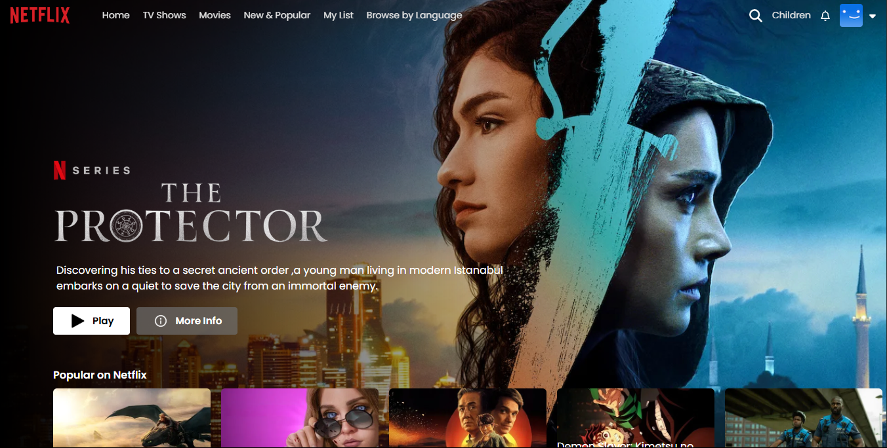
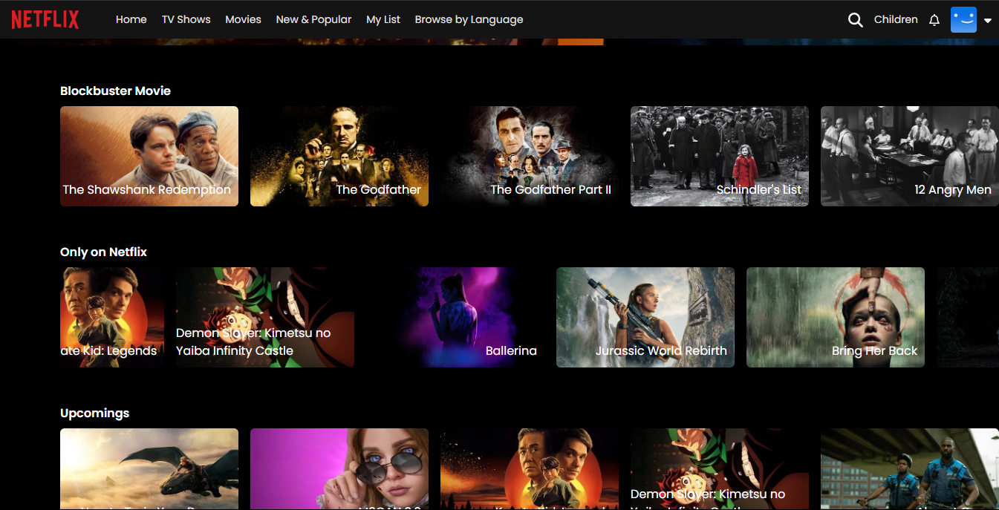
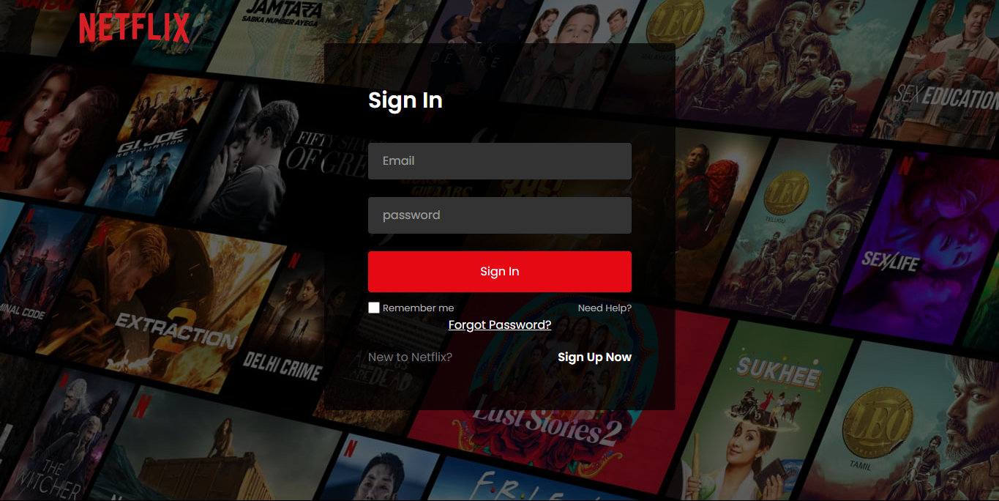
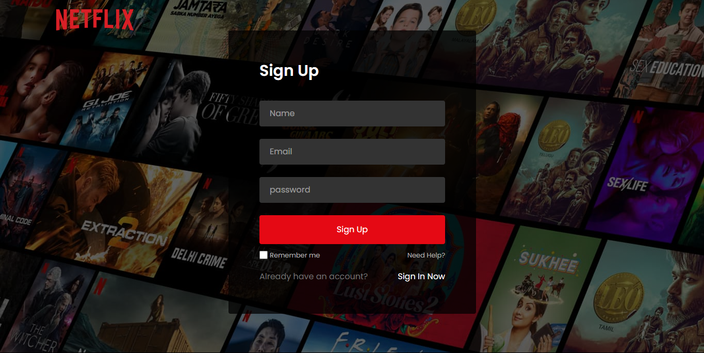
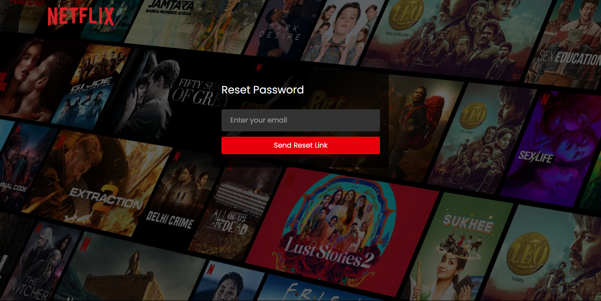

# 🎥🚀 **MovieHub** — *Your Cinematic Universe Awaits!*
> 😎 A stylish platform to discover, explore, and watch trailers of the latest movies.

[](https://moviehub-18.vercel.app/)
[](https://github.com/raunak-1703)


> 🚨 **Important:** TMDB API might not work in India without a VPN. This platform does **NOT** provide full movies — only trailers & clips via TMDB / YouTube `iframe`.

---

## 🎯 **Live Link**
👉 [🌐 **Visit MovieHub Now**](https://moviehub-18.vercel.app/)  

---

## 🔥 **Core Highlights**
| ⭐ Feature               | 🚀 Description                                      |
|--------------------------|----------------------------------------------------|
| 🔐 **Protected Routes**  | Only logged-in users can access content             |
| 🔑 **Firebase Auth**     | Login / Signup / Forgot Password / Logout / Remember Me |
| 🔔 **Toast Notifications** | Clean UI feedback via `react-toastify`               |
| 🎬 **Trailers / Clips Only** | No full movies — embedded trailers / clips only        |
| 📱 **Responsive**        | Mobile + Desktop friendly                           |
| 🎥 **Discover Movies**   | Data fetched from TMDB API                          |

---

## ⚙️ **Tech Stack at a Glance**
| 🚀 Technology | ⚒️ Purpose                     |
|---------------|--------------------------------|
| **React.js**      | UI & Component Architecture   |
| **React Router**  | Routing & Protection           |
| **Firebase Auth** | Authentication                 |
| **TMDB API**      | Movie Data                      |
| **Vite**          | Lightning-fast Build Tool       |
| **Toastify**      | Notification System             |
| **TailwindCSS / CSS**    | Styling                          |

---

## 🏗️ **Folder Structure (Clean Architecture)**
```plaintext
├── public/
│   ├── background images
│   └── favicons
├── src/
│   ├── assets/
│   ├── authentication/   # Login, Signup, Forgot Password, Logout, Remember Me
│   ├── components/       # Navbar, Footer, TitleCard
│   ├── context/          # AppContext
│   ├── pages/            # Home, Login, NotFound, PasswordReset, Player
│   ├── App.jsx
│   ├── index.jsx
│   └── main.jsx
├── .gitignore
├── eslint.config.js
├── index.html
├── package.json
├── package-lock.json
├── vite.config.js
```

---

## 🔐 **Authentication Flow**
✅ **Sign up / Login**  
✅ **Forgot Password via Email**  
✅ **Remember Me**  
✅ **Secure Logout**  
✅ **Protected Routes**  

---

## 🖼️ **Screenshots & Showcase**

| Category          | Screenshot             |
|-------------------|------------------------|
| **Hero Banner**|  |
| **Movie Cards** |  |
| **Login Page** |  |
| **Signup Page** |  |
| **Movie Details** |  |

## ⚠️ **Disclaimer**
🚫 **No full movies are displayed or hosted.**  
🎥 **Only trailers and official clips embedded via TMDB / YouTube.**  
🛡️ **For educational & demo purposes only.**

---

## 🚀 **What's Next?**
- [ ] User profiles & watchlists  
- [ ] Pagination / infinite scroll  
- [ ] Dark / light theme toggle  
- [ ] More polished animations  
- [ ] Improved error handling UX  

---

## 👨‍💻 **About Me**
| 💬 Name   | 🔗 GitHub   |
|-----------|------------|
| **Raunak** | [@raunak-1703](https://github.com/raunak-1703) |

---

## 📝 **License**
> 🔓 **For educational and portfolio purposes only.** Not for commercial distribution.
